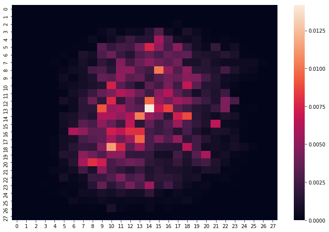
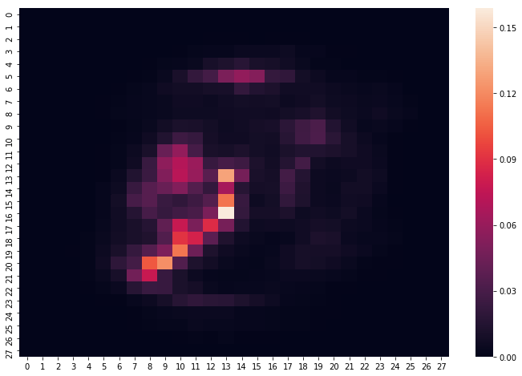
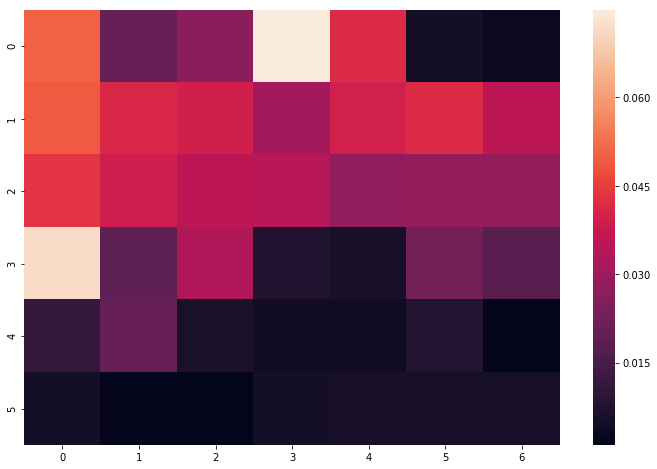
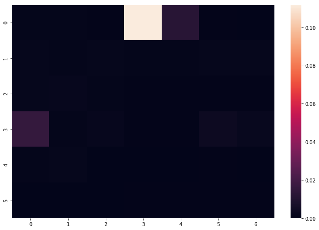
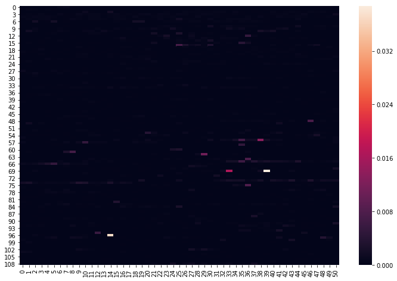
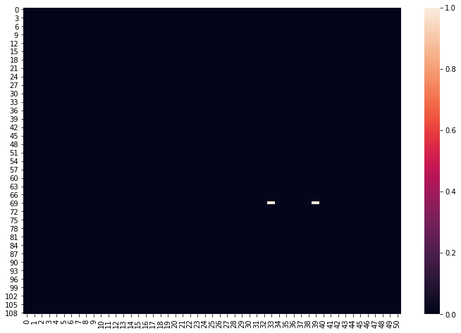
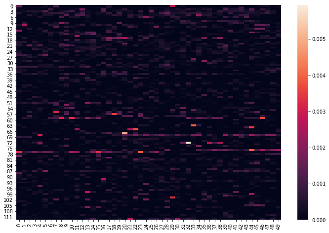
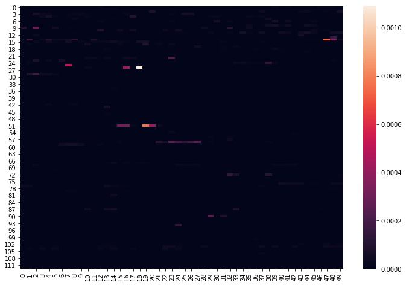

## 概要
論文 [Dropout Feature Ranking for Deep Learning Models](https://arxiv.org/abs/1712.08645) で提案されている Dropout Feature Ranking の手法を TensorFlow で実装した。
またその際に論文 [Concrete Dropout](https://arxiv.org/abs/1705.07832) で提案されているConcrete Relaxation の手法を用いた。

## Dropout Feature Ranking とは

Dropout Feature Ranking では、ネットワークを２つの段階に分けて学習を行う。この２つのステップとは下記である。

1. Pre-Train
2. Train

1 の Pre-Train フェーズは、通常の全結合層-バッチ正則化層-ドロップアウト層を積み重ねたニューラルネットワークの学習と同じである。

2 の Train フェーズは、１の入力層に Variational Dropout 層を追加することでモデルを確率的ニューラルネットワークに変更し、またドロップアウトされていないユニットの数に比例した正則化項を損失関数に加え、学習する。
この Variational Dropout 層は各入力ユニットのドロップアウト率をパラメータとしたベルヌーイ分布から発生する離散変数 z を含んでいるため、誤差を逆伝搬することができない。
この問題を解決するため、まずは離散型確率分布であるベルヌーイ分布の確率質量関数に似た形の確率密度関数を持ちその質量の大半が0と1の周辺に偏在する連続型確率分布（ Concrete Distribution ）をベルヌーイ分布の近似分布として用いる Concrete Relaxation という手法を用いた。
この近似分布に対して Reparameterization Trick という手法を用いることで逆伝搬を可能にした。
また、モデルが十分に学習される前に入力の大半がドロップアウトされてしまうのを防ぐため、
最初は正則化項の寄与を軽くし、エポックが進むに従って正則化項の寄与を増加させる Annealing Trick を適用した。

## 実験内容

### 実行環境
今回の実行環境は以下である。

```
OS: Ubuntu 16.04
NVIDIA-Driver 390.87
NVIDIA GeForce GTX 1080

Python 3.6.3 (Anaconda)
Numpy 1.14.5
TensorFlow 1.10.0
```

## 関連ファイルについて

一連の実験は、下記のファイルを上から順番に実行していくことで再現ができる。

1. `impl.py`: Dropout Feature Ranking の実装。
1. `01.quicklook.ipynb`: `HirosakiData`のデータ閲覧用ノートブック。
1. `02.preprocess_htn.ipynb`: `HTN`のデータセットを作成するための前処理。
1. `03.analyze_htn.ipynb`: `HTN`に対して、Dropout Feature Ranking を適用したファイル。 
1. `04.analyze_mnist.ipynb`: `MNIST`に対して、Dropout Feature Ranking を適用したファイル。 
1. `05.analyze_support2.ipynb`: `Support2`に対して、Dropout Feature Ranking を適用したファイル。 
1. `06.preprocess_dm.ipynb`: `DM`のデータセットを作成するための前処理。
1. `07.analyze_dm.ipynb`: `DM`に対して、Dropout Feature Ranking を適用したファイル。 


## Dropout Feature Ranking のアルゴリズムの実装について

`impl.py` を参照のこと。

### Reparameterization Trick
Reparameterization Trickを用いて、ドロップアウト率をパラメータとするベルヌーイ分布の近似分布（Concrete Distribution）に従う乱数を一様乱数のノイズをベースに発生させている。これによって逆伝搬が可能になっている。
```
def concrete_dropout_neuron(dropout_p, shape, temp=1.0 / 10.0):
    unif_noise = tf.random_uniform(shape)
    approx = (
          tf.log(dropout_p + eps)
        - tf.log(1. - dropout_p + eps)
        + tf.log(unif_noise + eps)
        - tf.log(1. - unif_noise + eps)
    )
    approx_output = tf.sigmoid(approx / temp)
    return 1. - approx_output
```

### 正則化項
ドロップアウトされていないユニット数に、ハイパーパラメータ regularizer_coef を掛けたものを正則化項としている。
ベルヌーイ分布ではなく Concrete Distribution を用いているので、各ユニットのドロップアウト率の総和をユニット数としてみなしている。

```
def eval_regularizer(logit_p):
    dropout_p = tf.sigmoid(logit_p)
    loss = 1. - dropout_p
    return loss

...

regularizer_coef   = 0.1
regularizer_loss   = regularizer_coef * tf.reduce_sum(eval_regularizer(logit_p))
```

### 損失関数
Pre-Train フェーズでは損失関数はクロスエントロピーのみであり、Train フェーズではクロスエントロピーに正則化項が加わる。プレースホルダ annealed_lambda には annealing(epoch, epoches) を渡している。これによりエポックが進むに従って徐々に正則化項 regularizer_loss の寄与が高くなる。
```
def annealing(epoch, epoches):
    rw_max = epoches / 2
    if epoch > rw_max:
        return 1.
    return epoch * 1.0 / rw_max

annealed_lambda    = tf.placeholder(tf.float32)
regularizer_loss   = regularizer_coef * tf.reduce_sum(eval_regularizer(logit_p))
crossentropy_loss  = tf.reduce_mean(-tf.reduce_sum(t * tf.log(y + eps), axis=1))
loss               = tf.cond(is_pretrain, 
    lambda: crossentropy_loss, 
    lambda: crossentropy_loss + annealed_lambda * regularizer_loss)
```

### モデル
Pre-Train フェーズでは入力はそのままニューラルネットに渡され、Train フェーズでは入力に Variational Dropout によるマスクが掛けられる。このマスクは各入力ユニットのドロップアウト率をパラメータとするベルヌーイ分布の近似分布である Concrete Distribution から Reparameterization Trick を用いて生成される。

```
bernoulli_approx   = concrete_dropout_neuron(dropout_p, tf.shape(x))
noised_x           = x * bernoulli_approx

h = tf.cond(is_pretrain, lambda:x, lambda:noised_x)
h = tf.layers.dense              (h, 170, tf.nn.relu)
h = tf.layers.batch_normalization(h, training=is_training)
h = tf.layers.dropout            (h, 0.5, training=is_training)
h = tf.layers.dense              (h, 170, tf.nn.relu)
h = tf.layers.batch_normalization(h, training=is_training)
h = tf.layers.dropout            (h, 0.5, training=is_training)
y = tf.layers.dense              (h, 10, tf.nn.softmax)
```

### 特徴量重要度
ドロップアウト率が低いユニットほど重要な特徴量であるとみなせるため、ドロップアウト率にマイナスを掛けたものを特徴量重要度として解釈している。
```
importance_vector = tf.sigmoid(-logit_p)
```

### 学習
Pre-Train フェーズで重みを学習してから、Train フェーズに以降している。

以下の2点が各フェーズで異なる。
```
h = tf.cond(is_pretrain, lambda:x, lambda:noised_x)
```
```
loss = tf.cond(is_pretrain, 
    lambda: crossentropy_loss, 
    lambda: crossentropy_loss + annealed_lambda * regularizer_loss)
```

epoches はハイパーパラメータである。スコアが目的ではなく、特徴量重要度を得る目的であれば、過学習気味のエポック数を指定したほうがスパースな解を得られることを確認した。
```
with tf.Session() as sess:
    sess.run(tf.global_variables_initializer())

    #
    # phase: pretraining
    #
    epoches = 200
    for epoch in range(epoches):
        X_, Y_ = utils.shuffle(X_train, Y_train)

        for i in range(n_batches):
            start = i * batch_size
            end   = start + batch_size

            sess.run(train_step, feed_dict={
                x: X_[start:end],
                t: Y_[start:end],
                is_training: True,
                is_pretrain: True,
                annealed_lambda: annealing(epoch, epoches),
                })

    #
    # phase: learning prob
    #
    epoches = 500
    for epoch in range(epoches):
        X_, Y_ = utils.shuffle(X_train, Y_train)

        for i in range(n_batches):
            start = i * batch_size
            end   = start + batch_size

            sess.run(train_step, feed_dict={
                x: X_[start:end],
                t: Y_[start:end],
                is_training: True,
                is_pretrain: False,
                annealed_lambda: annealing(epoch, epoches),
                })
```

## Dropout Feature Ranking の各データセットへの適用について。

Dropout Feature Ranking と RandomForest によって得られる特徴量重要度を比較し、下記２点を確認した。
1. 両モデルが近しい特徴量重要度を出力している
1. Dropout Feature Ranking による手法がよりスパースな解を得られている

ただし、不均衡データである DM のデータセットに関しては双方で多少異なる結果が出力された。
（糖尿病に関してネットで特徴量の意味を調べた限りにおいては、Dropout Feature Ranking の提示している特徴量重要度のほうが正しそうな感じをうけた。）


### MNIST への適用
#### RandomForest による特徴量重要度

 

#### Dropout Feature Ranking による特徴量重要度

 


両モデルともに画像中央の数字の描かれている領域を重要とみなしているのがわかる。Dropout Feature Ranking のほうがよりスパースな解を得られている。

### Support2 への適用
#### RandomForest による特徴量重要度ランキング



#### Dropout Feature Ranking による特徴量重要度ランキング




### HTN への適用
#### RandomForest による特徴量重要度ランキング
1. 四肢血圧_RbaPWV         0.038710
1. 脚点                  0.037129
1. 四肢血圧_LbaPWV         0.016552
1. 両足-X_50kHz          0.013252
1. 健康状況_服薬_処方薬の有無_2    0.010943



#### Dropout Feature Ranking による特徴量重要度ランキング
1. 四肢血圧_RbaPWV     0.998976
1. 四肢血圧_LbaPWV     0.998653
1. delta_lm_AUC    0.004743
1. lg_AUC          0.001910
1. lm_AUC          0.001367




### DM への適用
#### RandomForest による特徴量重要度ランキング
1. 四肢血圧_LbaPWV         0.005939
1. 内脂肪レベル              0.004988
1. 健康状況_医師_脂質異常症_なし    0.003971
1. 左半身-X_250kHz        0.003890
1. 左足-筋肉量              0.003876
1. 健康状況_服薬_高血圧治療薬      0.003858
1. 体重                  0.003643
1. 健康状況_医師_高血圧_治療中     0.003612
1. プロリン                0.003527
1. 血清鉄                 0.003339
1. 両足-X_250kHz         0.003313
1. 左足-R_50kHz          0.003311
1. 左腕-R_50kHz          0.003274
1. 両足-R_50kHz          0.003176
1. クレアチニン              0.003176
1. 収縮期血圧               0.003079
1. 四肢血圧_RABI           0.002903
1. 2014PG1             0.002838
1. 高血圧治療薬              0.002789
1. 総コレステロール            0.002785



#### Dropout Feature Ranking による特徴量重要度ランキング
1. delta_lm_AUC          0.001090
1. lm_AUC                0.000776
1. RCNH                  0.000745
1. delta_RCNH            0.000501
1. delta_lg_AUC          0.000429
1. lm_AUC_再測定            0.000419
1. RULE                  0.000332
1. lg_AUC_再測定            0.000312
1. lg_AUC                0.000308
1. DiagRuleCode          0.000293
1. 民間療法_健康器具_金額          0.000259
1. ルミノール_PH              0.000243
1. ルミノール再測定_PH           0.000241
1. delta_DiagRuleCode    0.000224
1. ルミノール_PH_1            0.000195
1. ルミノール_PH_3            0.000187
1. delta_ルミノール_PH        0.000167
1. NextAimWalk           0.000162
1. OZ_HE_CFI             0.000158
1. 白血球数                  0.000147



各モデルで違う結果となった。

## まとめ

Variational Dropout による特徴量重要度の分析手法である Dropout Feature Ranking を実装し、
MNIST, Support2, HTN, DM の各データセットに関して、Dropout Feature Ranking と RandomForest によって得られる特徴量重要度を比較した。


  
